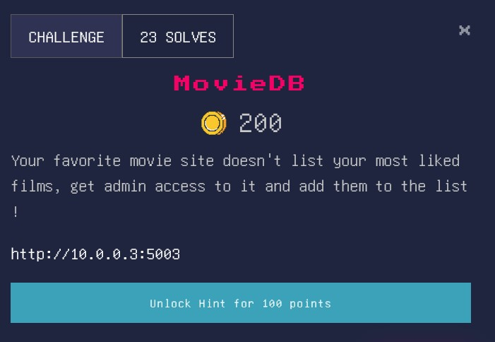
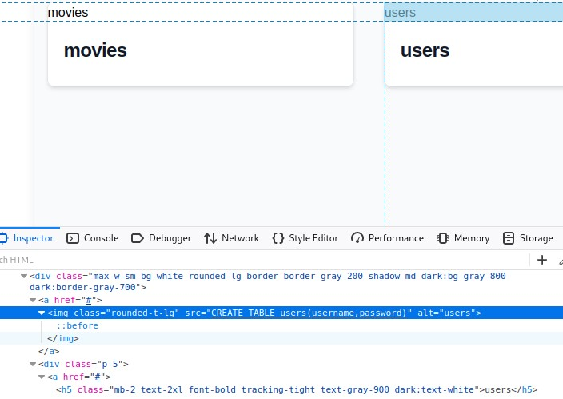
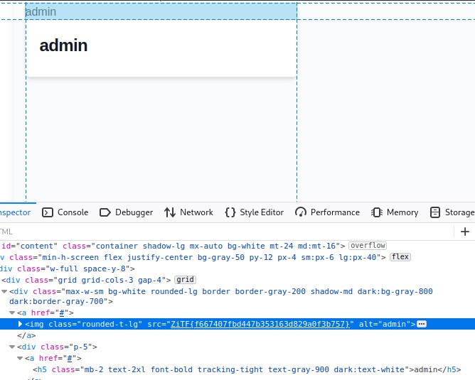

 If you prefer the latex version : 
 
 # Reconnaissance
 
 
This challenge offers us a movie site with a search bar, we immediately guess that there is surely a possibility of sql injection.

 # Exploitation

The first thing we see that seems interesting to exploit is the search bar. Let’s
try a classic sql injection that will surely cause an error due to its large number.

Now we have a precious information, the DBMS is sqlite3, we can adapt our
injections to it. Let’s try a more serious injection :

`'union select name,sql,null,null,null,null from sqlite_master where type='table' --; `

I put some null values in the injection for testing by adding a null until it
doesn’t print the error ”SELECTs to the left and right of UNION do not have
the same number of result columns”. The goal was to have the same number
of columns with the select executed in the site for searching movies.

The trick here was to pay attention to the source code because some
interesting sql code (create table ...) was there, we get the names of the
columns and we’ll simply do a final injection to get the data that we want
from users, result in the next page :

`'union select username,password,null,null,null,null from users --`

Flagged ! ZiTF{eLcVAVdDEfNmLjLEWGqF} in the source code
