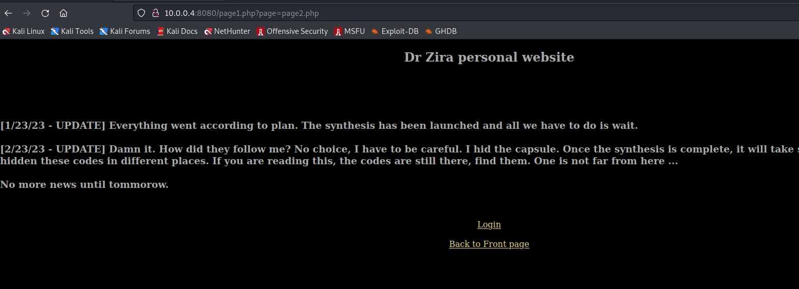
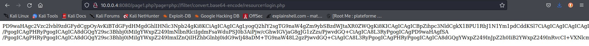

# Reconnaissance

Here we are in the zira's lab. We guess that there's a use of the include fonction in php because we can go to the page that we want with the page parameter. If you're trained to php challenges you detect that there's a potential file inclusion !



 # Exploitation

The exploitation part is very short because it could be made fastly with that following payload allowing us to read the login page (that we see by exploring the site) but encoded in base64



The result decoded gives us the login page code (at the start of the code line 6 in the screen), with precious ids

````php``
<?php session_start(); /* Starts the session */

        /* Check Login form submitted */
        if(isset($_POST['Submit'])){
                /* Define username and associated password array */
                $logins = array('zira' => 'MyUnguessablePasswordNotInRockYouMWAHAHAHA');

                /* Check and assign submitted Username and Password to new variable */
                $Username = isset($_POST['Username']) ? $_POST['Username'] : '';
                $Password = isset($_POST['Password']) ? $_POST['Password'] : '';

                /* Check Username and Password existence in defined array */
                if (isset($logins[$Username]) && $logins[$Username] == $Password){
                        /* Success: Set session variables and redirect to Protected page  */
                        $_SESSION['UserData']['Username']=$logins[$Username];
                        header("location:protect.php");
                        exit;
                } else {
                        /*Unsuccessful attempt: Set error message */
                        $msg="<span style='color:red'>Invalid Login Details</span>";
                }
        }

include('html/login.html');
?>
````php``

Flagged !
